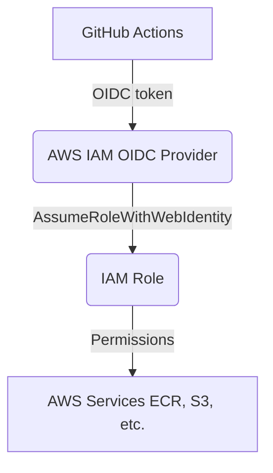

# 🔐 GitHub Actions OIDC Setup on AWS (No Access Keys)

This document explains how GitHub Actions authenticates with Amazon Web Services (AWS) using **OIDC (OpenID Connect)**, without storing long-lived AWS access keys.

## 🚀 Why OIDC?

Traditional CI/CD uses:
* `AWS_ACCESS_KEY_ID`
* `AWS_SECRET_ACCESS_KEY`

**The Problem:**
These keys are long-lived, risky if leaked, and hard to rotate.

**The Solution (OIDC):**
* No AWS keys are stored in GitHub.
* GitHub gets **temporary credentials**.
* AWS controls access via **IAM roles**.

---

## 🧱 Architecture Overview



---

## 🛠 Step 1: Create OIDC Provider in AWS

**AWS Console Path:**
`IAM` → `Identity providers` → `Add provider`

**Provider Configuration:**

| Field | Value |
| :--- | :--- |
| **Provider type** | `OpenID Connect` |
| **Provider URL** | `https://token.actions.githubusercontent.com` |
| **Audience** | `sts.amazonaws.com` |

1. Click **Add provider**.
2. This allows AWS to trust GitHub as an identity provider.

---

## 🛠 Step 2: Create IAM Role for GitHub Actions

**AWS Console Path:**
`IAM` → `Roles` → `Create role`

**Trusted Entity:**
1. Select **Web identity**.
2. **Identity provider:** `token.actions.githubusercontent.com`
3. **Audience:** `sts.amazonaws.com`
4. **GitHub organization:** `<your Github Username/Orgnization name>`
5. **GitHub repository:** `<The name of your repository>`
6. **GitHub branch:** `<Branch Name>`


**This ensures:**
* Only this specific GitHub repo can assume the role.
* No other repo can misuse it.

---

## 🛠 Step 3: Attach IAM Permissions to the Role to access ECR

 * Search it in permission policy search box `AmazonEC2ContainerRegistryPowerUser` select it 
 * Click next → give the Role Name → Creaet Role 

---

## 🛠 Step 5: Configure GitHub Repository Secrets

**In GitHub:**
`Repo` → `Settings` → `Secrets and variables` → `Actions`

Add **ONLY** these secrets:

| Secret Name | Description |
| :--- | :--- |
| `AWS_ACCOUNT_ID` | Your 12-digit AWS account ID |

> **❌ Do NOT add:**
> * `AWS_ACCESS_KEY_ID`
> * `AWS_SECRET_ACCESS_KEY`
>
> *OIDC replaces them completely.*

---

## 🛠 Step 6: Use OIDC in GitHub Actions Workflow

Here is a minimal workflow example.

**Crucial:** You must include `permissions: id-token: write`.

```yaml
permissions:
  id-token: write
  contents: read

 - name: Configure AWS Credentials (OIDC)
      uses: aws-actions/configure-aws-credentials@v5
      with:
        role-to-assume: arn:aws:iam::${{ secrets.AWS_ACCOUNT_ID }}:role/github-actions-ecr-role
        aws-region: ${{ env.AWS_REGION }}
```

**This step:**
1. Requests an OIDC token from GitHub.
2. Exchanges it with AWS STS.
3. Receives temporary credentials.
(Note: "github-actions-ecr-role" its a IAM role name replace it with your created name)
---

## ✅ Verification

When the workflow runs successfully:
* No AWS keys are visible in GitHub.
* AWS CloudTrail logs show `AssumeRoleWithWebIdentity`.
* Temporary credentials are auto-expired.

---

## 🧠 Key Takeaways

* **OIDC is more secure** than static AWS keys.
* **IAM controls** who and what GitHub can access.
* **Best practice** for modern CI/CD pipelines.
* Same approach works for **ECR, EKS, S3, Terraform**, etc.

  ## 👨‍💻 Author
**Nandkishor Khandare**  
Cloud & DevOps / SRE Engineer  

## 📬 **Contact**: 
 [Twitter]((https://x.com/devops_nk)) | [LinkedIn](https://www.linkedin.com/in/nandkishor-khandare-616492215/) | [Email](nandkishor.k6e@gmail.com) 
